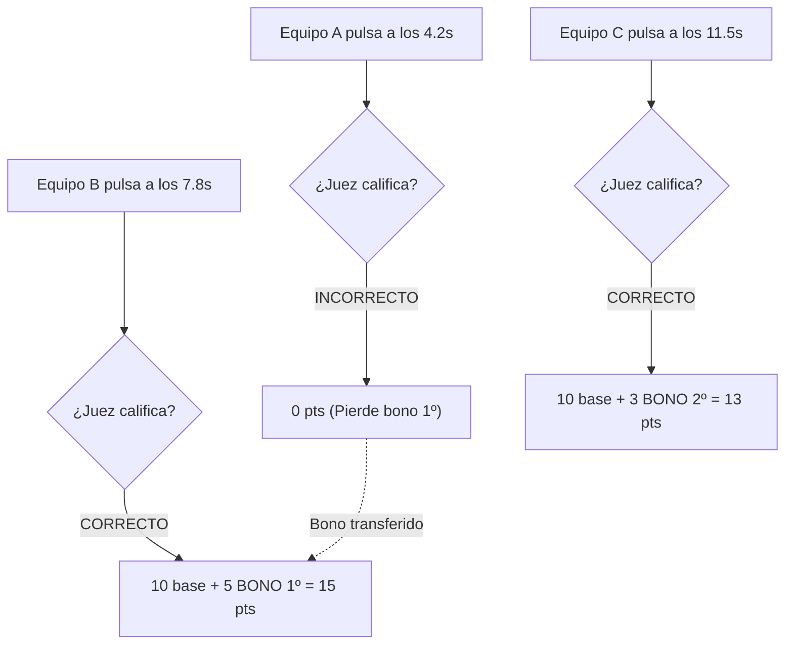

# 🏗️ Arquitectura de Software — QQSI (¿Quién Quiere Ser Ingeniero?)

Este documento describe la arquitectura técnica, el modelo de datos en memoria, la máquina de estados, el protocolo de eventos en tiempo real (Socket.IO), el algoritmo de puntuación con reasignación dinámica y las directrices de seguridad y despliegue del sistema **¿Quién Quiere Ser Ingeniero?**.

---

## 🧭 Visión General de la Arquitectura

QQSI es una plataforma web reactiva y tolerante a fallos, basada en el paradigma **Cliente-Servidor Orientado a Eventos en Tiempo Real** (*Event-Driven Real-Time Architecture*).

```mermaid
graph TB
    subgraph Clients["Nivel de Clientes (Frontend)"]
        Display["display.html<br>(Proyección Videobeam)"]
        Teams["team.html<br>(Pulsador Móvil Equipos)"]
        Admin["admin.html<br>(Consola del Moderador)"]
    end

    subgraph Edge["Nivel de Distribución (CDN / Edge)"]
        VercelCDN["Vercel Edge Network<br>(HTML, CSS, JS, Assets)"]
        ConfigAPI["/api/config<br>(Dynamic URL Resolution)"]
    end

    subgraph Core["Nivel de Servidor Central (Stateful Engine)"]
        Express["Express HTTP Server<br>(REST API & Headers)"]
        SocketEngine["Socket.IO Server<br>(WSS Bi-directional Engine)"]
        Validator["utils/validator.js<br>(Sanitizer & Rate Limiter)"]
        GameState["Master Game State<br>(In-Memory Thread-Safe State)"]
        ScoringEngine["Motor de Puntuación & Bonos<br>(Dynamic Reallocation Algorithm)"]
        QuestionsBank["data/questions.json<br>(Banco de 25 Preguntas)"]
    end

    Clients -->|1. Carga inicial estática| VercelCDN
    Clients -->|2. Handshake /api/config| ConfigAPI
    Clients <===>|3. WebSockets Persistentes (WSS)| SocketEngine

    SocketEngine --> Validator
    Validator --> GameState
    SocketEngine --> ScoringEngine
    ScoringEngine --> GameState
    GameState --> SocketEngine
    Express --> QuestionsBank
```

---

## ⚙️ Máquina de Estados del Concurso

El ciclo de vida de cada pregunta y ronda se modela formalmente mediante una máquina de estados finitos (*FSM*):

```mermaid
stateDiagram-v2
    [*] --> IDLE: Inicio del Servidor / Pregunta Cargada

    state IDLE {
        description: Pregunta seleccionada pero oculta en pantalla. Equipos en espera.
    }

    state RUNNING {
        description: Pregunta proyectada. Cronómetro corriendo. Pulsador ¡PULSAR! activo.
    }

    state PAUSED {
        description: Cronómetro congelado por el juez. Pulsaciones temporalmente bloqueadas.
    }

    state ENDED {
        description: Tiempo agotado o juez finalizó la pregunta. No se admiten más pulsaciones.
    }

    state EVALUATED {
        description: Juez calificó entregas. Puntos base y bonos de velocidad calculados y proyectados.
    }

    IDLE --> RUNNING: launch_question
    RUNNING --> PAUSED: pause_question
    PAUSED --> RUNNING: resume_question
    RUNNING --> ENDED: timer == 0 / stop_question
    PAUSED --> ENDED: stop_question
    ENDED --> EVALUATED: evaluate_submission
    EVALUATED --> IDLE: next_question / change_question
    EVALUATED --> [*]: next_round (Fin de Fase)
```

---

## 📊 Modelo de Datos en Memoria (`Master Game State`)

Toda la verdad del sistema reside en memoria en `server.js` bajo la estructura `gameState`, lo que garantiza latencias de respuesta menores a **5 milisegundos**:

```typescript
interface GameState {
  teams: Team[];
  currentRoundIndex: number;      // 0 a 3 (Fácil, Normal, Difícil, Experto)
  currentQuestionIndex: number;   // Índice de la pregunta en la ronda actual
  questionState: 'idle' | 'running' | 'paused' | 'ended' | 'evaluated';
  timer: {
    duration: number;             // Duración nominal (ej. 120 segundos)
    remaining: number;            // Segundos restantes
    isRunning: boolean;
    startTime: number | null;     // Epoch timestamp (Date.now())
    endTime: number | null;       // Epoch timestamp calculado
  };
  currentQuestion: Question | null;
  submissions: Submission[];      // Cola de pulsaciones de la pregunta activa
  roundScores: Record<string, number>; // Puntos acumulados en la ronda actual
  history: QuestionHistoryEntry[];     // Archivo histórico de preguntas concluidas
  roundSummary: any | null;
}

interface Team {
  id: 'sistemas' | 'software' | 'alimentos' | 'quimica' | 'civil' | 'petroquimica';
  name: string;
  shortName: string;
  color: string;
  eliminated: boolean;
  score: number;
  eliminatedInRound: number | null;
}

interface Submission {
  teamId: string;
  teamName: string;
  submittedAt: number;           // Epoch timestamp
  elapsedMs: number;             // Milisegundos transcurridos desde el inicio
  correct: boolean | null;       // null = Pendiente, true = Correcto, false = Incorrecto
  basePoints: number;            // 10 puntos si correct === true
  bonusPoints: number;           // 5, 3 o 1 punto por velocidad
  totalPoints: number;           // basePoints + bonusPoints
}
```

---

## 🧮 Motor de Puntuación y Reasignación Dinámica de Bonos

Uno de los requerimientos críticos del concurso es que los **bonos de velocidad premian exclusivamente a respuestas correctas**, con transferencia automática en caso de error:

### 1. Reglas Matemáticas
- **Puntuación Base**: Toda respuesta correcta otorga exactamente **10 puntos base**.
- **Bonos de Velocidad Disponibles**:
  - **1º Lugar en entregar correctamente**: `+5 puntos`
  - **2º Lugar en entregar correctamente**: `+3 puntos`
  - **3º Lugar en entregar correctamente**: `+1 punto`
- **Respuestas Incorrectas**: `0 puntos base`, `0 bonos`.

### 2. Algoritmo de Reasignación Automática

Si el equipo que pulsó primero se equivoca, el bono de `+5 puntos` **no se pierde**: se reasigna inmediatamente al siguiente equipo en la cola de pulsaciones cuya respuesta haya sido calificada como correcta:

```javascript
function recalculateScores() {
  // 1. Filtrar únicamente las entregas aprobadas por el juez
  const correctSubmissions = gameState.submissions.filter(s => s.correct === true);
  const SPEED_BONUSES = [5, 3, 1];

  // 2. Asignar bonos según el orden relativo de acierto (no de llegada bruta)
  gameState.submissions.forEach(sub => {
    if (sub.correct === true) {
      sub.basePoints = 10;
      const rankIdx = correctSubmissions.indexOf(sub);
      sub.bonusPoints = (rankIdx >= 0 && rankIdx < SPEED_BONUSES.length) ? SPEED_BONUSES[rankIdx] : 0;
      sub.totalPoints = sub.basePoints + sub.bonusPoints;
    } else {
      sub.basePoints = 0;
      sub.bonusPoints = 0;
      sub.totalPoints = 0;
    }
  });

  // 3. Acumular los puntos de las preguntas históricas de la ronda + pregunta activa
  // ...
}
```



---

## 📡 Matriz de Protocolos de Socket.IO

### 1. Eventos Emitidos por Clientes (Client ➔ Server)

| Evento | Origen | Carga Útil (*Payload*) | Validación / Seguridad |
| :--- | :--- | :--- | :--- |
| `admin_login` | Admin | `{ password: string }` | Rate Limit: 6 intentos / 15s. Verificación contra `ADMIN_PASSWORD`. |
| `team_login` | Equipo | `{ teamId: string, password: string }` | Rate Limit: 8 intentos / 10s. Verificación contra `TEAM_PASSWORDS[teamId]`. |
| `launch_question` | Admin | `{ roundIndex: number, questionIndex: number }` | Verifica que el estado no sea `running`. Inicializa temporizador. |
| `pause_question` | Admin | `{}` | Detiene el intervalo del timer y emite estado `paused`. |
| `resume_question` | Admin | `{}` | Reanuda el timer con el tiempo remanente. |
| `stop_question` | Admin | `{}` | Fuerza el cese del tiempo y bloquea nuevas pulsaciones. |
| `submit_answer` | Equipo | `{ teamId: string, elapsedMs: number }` | Verifica `questionState === 'running'`, equipo activo y no duplicado. |
| `evaluate_submission` | Admin | `{ teamId: string, correct: boolean }` | Ejecuta `recalculateScores()` y archiva en histórico. |
| `eliminate_team` | Admin | `{ teamId: string }` | Marca al equipo como eliminado y actualiza podio. |
| `next_question` | Admin | `{}` | Avanza el puntero de pregunta, archiva entregas y emite `idle`. |
| `next_round` | Admin | `{}` | Incrementa `currentRoundIndex`, reinicia puntajes acumulados de ronda. |
| `reset_game` | Admin | `{}` | Reinicia el concurso a Ronda 1 con todos los equipos activos y 0 puntos. |
| `toggle_leaderboard` | Admin | `{ visible: boolean }` | Conmuta la visibilidad del ranking en la pantalla gigante. |

### 2. Eventos Transmitidos por el Servidor (Server ➔ Broadcast)

| Evento | Destinatarios | Contenido | Frecuencia |
| :--- | :--- | :--- | :--- |
| `state_update` | Todos | Snapshot completo de `gameState` (pregunta oculta si está en `idle`). | En cada cambio de estado, evaluación o transición. |
| `timer_tick` | Todos | `{ remaining: number }` | Cada 1000 ms mientras el cronómetro corre. |
| `question_time_up`| Todos | `{}` | Al llegar el cronómetro exactamente a 0. |
| `submission_received`| Admin / Display | `{ teamId: string, elapsedMs: number, order: number }` | Instantáneamente cuando un equipo pulsa el botón. |
| `submission_ack` | Equipo emisor | `{ ok: boolean, elapsedMs: number, order: number }` | Acuse de recibo de entrega exitosa. |
| `leaderboard_visibility`| Display | `{ visible: boolean }` | Cuando el moderador decide proyectar u ocultar el podio. |

---

## 🛡️ Capa de Seguridad y Robustez (`utils/validator.js`)

1. **Defensa contra Ataques de Fuerza Bruta (In-Memory Sliding Window)**:
   - Controla las solicitudes de autenticación por IP (`checkRateLimit`).
   - Tras 8 intentos fallidos dentro de una ventana de 10 segundos, bloquea temporalmente al cliente.
   - Cuenta con un recolector de basura periódico (`cleanupInterval.unref()`) cada 30 segundos para evitar fugas de memoria (*memory leaks*).
2. **Sanitización Estricta de Entradas**:
   - `cleanString()`: Remueve caracteres de control ASCII (`[\x00-\x1F\x7F]`), previene inyecciones de escape y limita la longitud a 150 caracteres.
   - `sanitizePayload()`: Limpia recursivamente objetos JSON antes de procesarlos en el motor de juego.
3. **Encabezados HTTP de Seguridad (OWASP)**:
   - `X-Content-Type-Options: nosniff`
   - `X-Frame-Options: SAMEORIGIN`
   - `X-XSS-Protection: 1; mode=block`
   - `Referrer-Policy: strict-origin-when-cross-origin`
   - `Permissions-Policy: camera=(), microphone=(), geolocation=()`

---

## 🚀 Estrategia de Despliegue y Red Local

### 1. Modo Evento en Vivo (Red Local Wi-Fi - Sin Internet)
- El servidor Node.js se ejecuta en la laptop del moderador conectada al router del auditorio.
- Al arrancar, `server.js` inspecciona las interfaces de red (`os.networkInterfaces()`) e imprime la IP LAN:
  ```plaintext
  Servidor disponible en: http://192.168.1.105:3000
  ```
- Los celulares de los equipos escanean el código QR o ingresan a dicha IP con latencias locales de **1 a 3 ms**.

### 2. Modo Híbrido en la Nube (Vercel + Coolify)
- **Frontend**: Hospedado en la red global CDN de Vercel para descarga ultrarrápida de activos estáticos.
- **Backend**: Contenedor Docker en VPS con Coolify gestionando las conexiones persistentes WSS (`wss://qqsi...sslip.io`).
- El script [`public/js/config.js`](file:///c:/Daniel/QQSI/public/js/config.js) detecta el dominio del cliente y establece la conexión WSS adecuada de manera 100% transparente.
