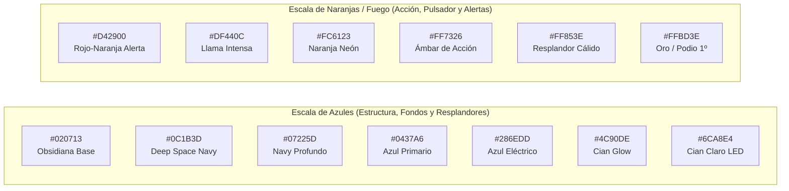
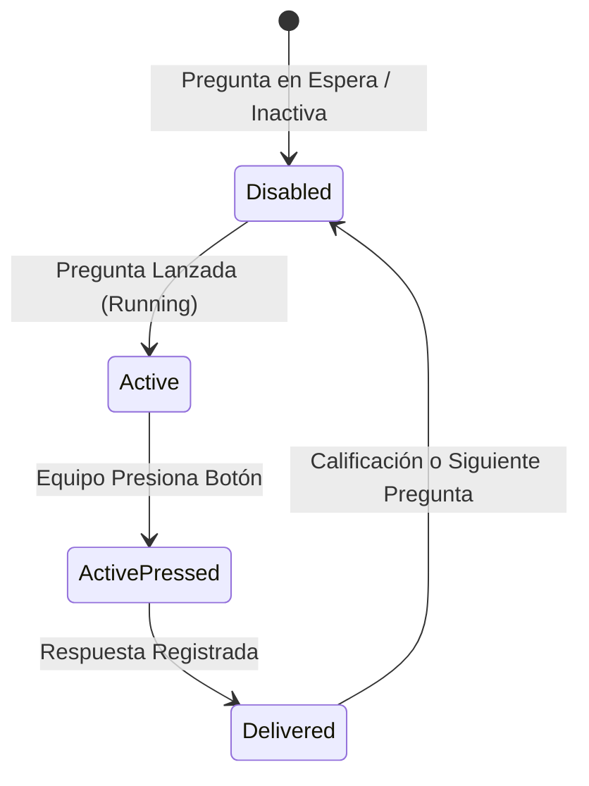

# 🎨 Sistema de Diseño — Liquid Glass UI (QQSI)

Este documento describe la especificación técnica completa del sistema de diseño **Liquid Glass**, la paleta de colores de alto contraste, los tokens de diseño, las especificaciones de componentes y las directrices de accesibilidad implementadas en **¿Quién Quiere Ser Ingeniero?**.

---

## 💎 Filosofía de Diseño: Liquid Glass

El sistema **Liquid Glass** fusiona la estética de *glassmorphism* moderno con la emoción de los controles táctiles de concursos televisivos de alta tecnología (*high-stakes game show*):

1. **Refracción Especular & Superficies Cristalinas**:
   - Cada tarjeta actúa como una placa de cristal pulido con refracciones superiores (`border-top: 2.5px solid rgba(255, 255, 255, 0.95)`), desenfoque de fondo profundo (`backdrop-filter: blur(28px) saturate(220%)`) y un haz de luz superior (`.denim-card::after`).
2. **Alto Contraste y Separación Tridimensional**:
   - Para evitar el empastado monocromático, el lienzo de fondo se asienta sobre un **navy obsidiana profundo** (`#020713`), lo que permite que las placas de cristal, los bordes cian neón y los botones de acción naranja resalten con máxima visibilidad en pantallas de auditorio y proyectores de alto brillo.
3. **Cero Dependencias Externas (100% Native CSS)**:
   - Todo el sistema de diseño está construido con CSS nativo moderno, sin Tailwind CDN, sin Bootstrap y sin bibliotecas de terceros que requieran descarga o compilación previa.
4. **Cero Emojis (Garantía Vectorial SVG)**:
   - Las medallas de podio, cronómetros y flechas son renderizados mediante vectores SVG optimizados con dimensiones estrictas para máxima nitidez en pantallas Retina y proyectores 4K.

---

## 🎨 Paleta de Colores Oficial

La paleta se organiza en dos escalas cromáticas complementarias con alto contraste térmico: **Azules Líquidos (Fríos/Estructurales)** y **Naranjas Fuego (Cálidos/Acción/Urgencia)**.



### 1. Escala de Azules (Escala Primaria y Estructural)

| Token / HEX | Nombre | Rol Semántico / Uso |
| :--- | :--- | :--- |
| `#020713` | **Obsidian Base** | Base ultra-oscura del fondo dinámico para generar contraste máximo. |
| `#0C1B3D` | **Deep Space Navy** | Fondo estructural de tarjetas, modales y barras de navegación. |
| `#07225D` | **Navy Profundo** | Sombra interna y gradientes de profundidad en componentes elevados. |
| `#032D8D` | **Rich Blue** | Zona de sombra en gradientes de botones e insignias. |
| `#0437A6` | **Azul Primario** | Fondo principal de botones de acción y estado correcto evaluado. |
| `#0140B9` | **Azul Vibrante** | Núcleo de gradientes de acento interactivo. |
| `#286EDD` | **Azul Eléctrico** | Color de éxito (*success*), botones primarios y cinta de medallas. |
| `#4C90DE` | **Cian Glow** | Acento luminoso principal, anillos de foco y resplandor de temporizador. |
| `#6CA8E4` | **Cian Claro LED** | Dígitos del cronómetro LED, textos secundarios iluminados y rebordes. |

### 2. Escala de Naranjas / Fuego (Acentos, Pulsador y Urgencia)

| Token / HEX | Nombre | Rol Semántico / Uso |
| :--- | :--- | :--- |
| `#D42900` | **Alerta Profunda** | Fondo del pulsador en reposo activo, estado urgente y avisos de error. |
| `#DF440C` | **Fuego Vivo** | Gradiente de alerta de eliminación y reborde de peligro. |
| `#E84F0B` | **Naranja Cálido** | Transición en gradientes de pulsador y botones de moderación. |
| `#FC6123` | **Naranja Eléctrico** | **Color central del Pulsador Arcade**, botón principal del juez y podio 3º. |
| `#FF7326` | **Ámbar Brillante** | Resplandor del pulsador pulsante y acentos de advertencia. |
| `#FF853E` | **Luz Cálida** | Resplandor de hover y badge de equipos activos. |
| `#FFA03E` | **Aura Suave** | Brillo periférico de tarjetas de moderador. |
| `#FFBD3E` | **Oro Podio** | Medalla de 1º lugar, dígito #1 en resultados y cúpula del pulsador. |

---

## 🧩 Tokens de Diseño en `:root`

```css
:root {
  /* Tokens de Superficie Liquid Glass */
  --liquid-glass-bg: rgba(12, 27, 61, 0.65);
  --liquid-glass-border: rgba(108, 168, 228, 0.45);
  --liquid-glass-glow: 0 0 0 1px rgba(76, 144, 222, 0.25), 0 8px 32px rgba(0, 0, 0, 0.6);
  --liquid-glass-radius: 22px;

  /* Capa 1: Primitivas Cromáticas */
  --liquid-deep-space: #020713;
  --liquid-navy-1: #0C1B3D;
  --liquid-navy-2: #07225D;
  --liquid-cyan-glow: #4C90DE;
  --liquid-blue-glow: #286EDD;
  --liquid-amber-glow: #FF7326;
  --liquid-red-glow: #D42900;
  
  /* Capa 2: Refracción y Sombras Especulares */
  --glass-bg: linear-gradient(145deg, rgba(32, 75, 145, 0.45) 0%, rgba(14, 38, 80, 0.85) 38%, rgba(6, 18, 42, 0.96) 100%);
  --glass-border: rgba(108, 168, 228, 0.6);
  --glass-border-top: rgba(255, 255, 255, 0.95);
  --glass-inner-gloss: inset 0 2px 4px 0 rgba(255, 255, 255, 0.65);
  --glass-inner-shadow: inset 0 -2px 4px 0 rgba(0, 0, 0, 0.7);
  --glass-blur: blur(28px) saturate(220%);
  --glass-shadow: 0 0 0 1px rgba(76, 144, 222, 0.35), 0 0 45px rgba(76, 144, 222, 0.3), 0 30px 70px -5px rgba(0, 0, 0, 0.95);
  
  /* Capa 3: Interacción y Ergonomía */
  --focus-ring: #4C90DE;
  --btn-radius: 14px;
  --card-radius: 28px;
  --transition-liquid: 200ms cubic-bezier(0.16, 1, 0.3, 1);
}
```

---

## 📐 Especificación de Componentes Clave

### 1. La Tarjeta Liquid Glass (`.denim-card`)

Es el contenedor principal de contenido en todas las vistas:

```css
.denim-card {
  background: var(--glass-bg) !important;
  backdrop-filter: var(--glass-blur) !important;
  -webkit-backdrop-filter: var(--glass-blur) !important;
  border: 2px solid var(--glass-border) !important;
  border-top: 2.5px solid var(--glass-border-top) !important;
  border-left: 2px solid rgba(255, 255, 255, 0.75) !important;
  border-radius: var(--card-radius);
  box-shadow: var(--glass-shadow), var(--glass-inner-gloss), var(--glass-inner-shadow) !important;
  position: relative;
  overflow: hidden;
}
```

- **Marco Holográfico Interior (`::before`)**: Reemplaza las antiguas viñetas/costuras punteadas. Genera un bisel nítido a 10px del borde con acentos en degradé radial en las esquinas (cian en superior-izquierda y naranja en inferior-derecha).
- **Haz de Luz Superior (`::after`)**: Un resplandor de 3px de grosor con gradiente translúcido centrado en la parte superior que simula el reflejo de iluminación del estudio.

---

### 2. El Pulsador Arcade Gigante (`.buzzer-arcade-btn`)

El elemento central de la experiencia móvil para los 5 equipos:



- **Estado Inactivo / En Espera (`:disabled`)**:
  - Dial de consola táctil de cristal oscuro con refracción metálica:
  - `background: radial-gradient(circle at 35% 25%, #2a4e80 0%, #17335c 38%, #0a1b35 72%, #040d1c 100%)`
  - Borde metálico de cristal cian de 7px (`border: 7px solid rgba(108, 168, 228, 0.75)`).
  - Icono vectorial con filtro de luz (`drop-shadow(0 0 8px rgba(76, 144, 222, 0.8))`) y tipografía blanca de alto contraste.
- **Estado Activo (`.pulsing:not(:disabled)`)**:
  - Gradiente radial de fuego multicapa: `#FFBD3E` (dorado) → `#FF7326` (ámbar) → `#FC6123` (naranja) → `#DF440C` → `#D42900` (rojo).
  - Borde blanco sólido de 7px.
  - Animación `buzzer-glow-pulse`: Escala de 1.0 a 1.035 con resplandor neón naranja de hasta 60px (`rgba(255, 115, 38, 0.95)`).

---

### 3. Insignia / Banner Flotante (`.ribbon-banner`)

Reemplaza los antiguos lazos recortados por un emblema aerodinámico de cristal:
- Forma: Píldora redondeada completa (`border-radius: 9999px;`).
- Degradé: `linear-gradient(135deg, #0140B9 0%, #0437A6 35%, #286EDD 70%, #FC6123 100%)`.
- Bisel superior: `border-top: 1.5px solid rgba(255, 255, 255, 0.9)`.
- Tipografía: **Cabinet Grotesk**, peso 900, mayúsculas con espaciado de letras (`letter-spacing: 0.04em`).

---

### 4. Temporizador Digital LED Cristalino (`.timer-led-box`)

- Contenedor: Cristal oscuro de alta densidad (`rgba(3, 8, 20, 0.95)`) con bisel cian de 1.5px y doble reborde superior blanco.
- Dígitos: Fuente monoespaciada **JetBrains Mono**, peso 900, tamaño 32px a 44px, color `#6CA8E4` con doble resplandor exterior (`text-shadow: 0 0 14px rgba(76, 144, 222, 0.95), 0 0 28px rgba(76, 144, 222, 0.6)`).
- **Estado Urgente (`.urgent`)**: Se activa automáticamente en los últimos 30 segundos. El bisel y los números conmutan a rojo fuego `#D42900` con animación de pulso rítmico (`@keyframes pulse-urgent`).

---

## 🔤 Tipografía y Jerarquía

El sistema emplea 4 fuentes web de alta fidelidad importadas desde Google Fonts:

| Familia | Pesos Utilizados | Uso Exclusivo |
| :--- | :--- | :--- |
| **Cabinet Grotesk** | 700, 800, 900 | Títulos principales, números de podio, botones arcade e insignias de ronda. |
| **Inter** | 400, 500, 600, 700 | Cuerpo de texto, enunciados de preguntas, etiquetas de equipos y controles. |
| **JetBrains Mono** | 500, 700, 800, 900 | Temporizador digital LED, registro de milisegundos y puntos de tabla. |
| **Playfair Display** | 700 (Cursiva) | Subtítulos elegantes de ceremonia y diplomas. |

---

## ♿ Accesibilidad y Rendimiento

1. **Cumplimiento WCAG 2.1 AA / AAA**:
   - Todo texto blanco `#ffffff` sobre fondos oscuros o sobre el gradiente de tarjetas supera una relación de contraste superior a **7:1**.
   - Los anillos de foco accesibles (`:focus-visible`) aplican un contorno de `2px solid var(--focus-ring)` con `outline-offset: 3px` y resplandor cian para navegación por teclado.
2. **Respeto a Preferencias de Movimiento (`prefers-reduced-motion`)**:
   - Los usuarios con sensibilidad al movimiento tienen desactivadas las transiciones largas y las animaciones de pulso (`animation-duration: 0.01ms !important`).
3. **Optimización de Renderizado GPU**:
   - Las animaciones utilizan únicamente transformaciones compuestas (`transform: scale()`, `transform: translateY()`, `opacity`), evitando reflujos de diseño (*layout reflows*).
