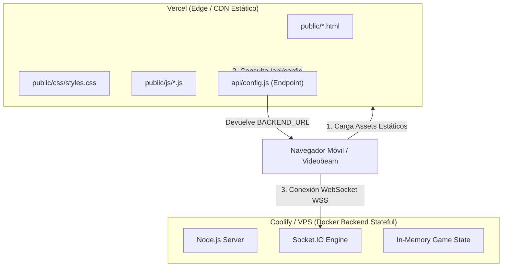
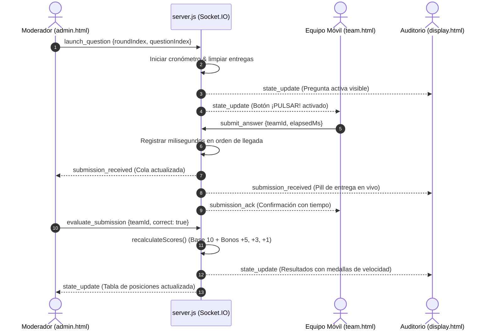

# 📁 Estructura del Proyecto — QQSI (¿Quién Quiere Ser Ingeniero?)

Este documento detalla la organización de directorios, responsabilidades de cada archivo, flujo de dependencias y el mapa completo del repositorio del sistema interactivo en tiempo real **¿Quién Quiere Ser Ingeniero?**.

---

## 🌳 Árbol Completo del Directorio

```plaintext
c:\Daniel\QQSI\
├── .dockerignore                 # Exclusiones de contexto para construcción Docker
├── .env                          # Variables de entorno locales (credenciales, puertos, URLs)
├── .env.example                  # Plantilla de configuración de variables de entorno
├── .gitignore                    # Reglas de omisión de Git (node_modules, logs, envs)
├── Dockerfile                    # Configuración multicapa de contenedor Docker (Coolify / VPS)
├── package.json                  # Manifiesto de dependencias npm, scripts y metadatos
├── package-lock.json             # Árbol exacto de versiones de dependencias instaladas
├── README.md                     # Guía rápida de presentación, instalación y ejecución
├── STRUCTURE.md                  # [Este archivo] Estructura exhaustiva del proyecto
├── DESIGN.md                     # Sistema de diseño, tokens, paleta y componentes Liquid Glass
├── ARCHITECTURE.md               # Arquitectura de software, protocolo WebSockets y modelo de estado
├── server.js                     # Servidor Node.js/Express y motor Socket.IO en tiempo real
├── start.bat                     # Script de inicio rápido de un solo clic para Windows
├── test_system.js                # Suite de pruebas automatizadas end-to-end de sockets y estado
├── vercel.json                   # Enrutamiento y configuración de despliegue para Vercel
│
├── api/
│   └── config.js                 # Serverless endpoint de Vercel para handshake de URL dinámica
│
├── data/
│   └── questions.json            # Banco oficial de 25 preguntas agrupadas por ronda y dificultad
│
├── public/                       # Frontend estático entregado a navegadores web
│   ├── admin.html                # Panel de control maestro del moderador / juez
│   ├── display.html              # Pantalla de proyección para auditorio y videobeam
│   ├── index.html                # Hub central y selector de roles
│   ├── team.html                 # Interfaz móvil para los equipos participantes (pulsador)
│   │
│   ├── css/
│   │   └── styles.css            # Sistema de diseño Liquid Glass 100% nativo CSS (sin frameworks)
│   │
│   ├── js/
│   │   ├── admin.js              # Controlador lógico del panel de moderación
│   │   ├── config.js             # Gestor dinámico de conexión WebSocket (Vercel <-> Coolify)
│   │   ├── display.js            # Controlador de la pantalla gigante y animaciones de podio
│   │   ├── icons.js              # Biblioteca de iconos vectoriales SVG limpios (cero emojis)
│   │   ├── questions.js          # Fallback y carga del banco de preguntas del cliente
│   │   └── team.js               # Controlador del pulsador arcade de los equipos
│   │
│   └── img/                      # Activos gráficos vectoriales y de marca
│       ├── cover_reference.png   # Referencia visual de la estética original
│       ├── logo.png              # Isotipo del concurso
│       ├── logo-ceis.png         # Escudo oficial de la carrera / CEIS
│       ├── logo-ecs.svg          # Logotipo vectorial de la facultad
│       ├── origami-boat.svg      # Motivo decorativo: barco de papel
│       ├── origami-stars.svg     # Motivo decorativo: estrellas de papel
│       ├── slide_template.png    # Plantilla de referencia para diapositivas
│       └── waves.svg             # Cenefa inferior de olas
│
├── scratch_slides/               # Capturas y referencias de diapositivas del evento
│   ├── page_1.png ... page_31.png
│
└── utils/
    └── validator.js              # Módulo de sanitización, rate limiting y validación de entradas
```

---

## 📦 Detalle de Componentes y Responsabilidades

### 1. Núcleo del Backend y Ejecución

| Archivo | Responsabilidad Principal |
| :--- | :--- |
| [`server.js`](file:///c:/Daniel/QQSI/server.js) | Servidor HTTP Express y Socket.IO. Mantiene el **Master Game State** en memoria, gestiona la máquina de estados del cronómetro, procesa pulsaciones en milisegundos, ejecuta el algoritmo de asignación de bonos y transmite eventos en tiempo real. |
| [`utils/validator.js`](file:///c:/Daniel/QQSI/utils/validator.js) | Protección contra ataques de fuerza bruta (Rate Limiting de 10s con limpieza periódica de memoria), sanitización recursiva de payloads JSON, eliminación de caracteres de control y validación estricta de IDs de equipos permitidos. |
| [`test_system.js`](file:///c:/Daniel/QQSI/test_system.js) | Script de prueba que simula conexiones concurrentes de sockets, envío de pulsaciones y verificación de integridad del cálculo de puntajes. |
| [`start.bat`](file:///c:/Daniel/QQSI/start.bat) | Script por lotes para Windows que detecta Node.js, ejecuta `npm start` y abre la ventana del terminal con la IP local para facilitar la conexión en redes Wi-Fi. |

---

### 2. Infraestructura y Despliegue Híbrido

El proyecto está diseñado con una arquitectura de despliegue dual:



- [`Dockerfile`](file:///c:/Daniel/QQSI/Dockerfile): Imagen ligera basada en `node:18-alpine` para desplegar el servidor en Coolify, Render, Railway o VPS propio con soporte de WebSockets bidireccionales persistentes.
- [`vercel.json`](file:///c:/Daniel/QQSI/vercel.json): Configura las rutas estáticas de `public/` y redirige `/api/config` hacia la función serverless en `api/config.js`.
- [`api/config.js`](file:///c:/Daniel/QQSI/api/config.js): Lee la variable de entorno `BACKEND_URL` para que el frontend alojado en Vercel sepa automáticamente a qué servidor WebSocket debe conectarse.

---

### 3. Frontend: Vistas de Usuario (HTML)

| Archivo | Rol en el Concurso | Características Clave |
| :--- | :--- | :--- |
| [`public/index.html`](file:///c:/Daniel/QQSI/public/index.html) | **Hub Principal** | Pantalla de bienvenida con tarjetas interactivas Liquid Glass para ingresar a Proyección, Equipos o Administración. |
| [`public/display.html`](file:///c:/Daniel/QQSI/public/display.html) | **Proyección / Auditorio** | Diseñada para videobeam 1080p/4K. Incluye visualización de fórmulas KaTeX, código C++ resaltado con Prism.js, cronómetro digital gigante y lista en vivo de pulsaciones recibidas. |
| [`public/team.html`](file:///c:/Daniel/QQSI/public/team.html) | **Pulsador de Equipos** | Interfaz móvil táctil responsive. Cuenta con modal de autenticación por carrera, visualización de la pregunta activa, y el gran botón arcade interactivo con registro de milisegundos. |
| [`public/admin.html`](file:///c:/Daniel/QQSI/public/admin.html) | **Panel del Juez** | Centro de comando con rejilla de 3 columnas: banco de preguntas y rondas a la izquierda, vista previa y control de cronómetro al centro, y cola de calificación manual con tabla de posiciones a la derecha. |

---

### 4. Frontend: Lógica y Controladores (JavaScript)

- [`public/js/config.js`](file:///c:/Daniel/QQSI/public/js/config.js): Cliente de configuración que efectúa un handshake inicial con `/api/config`. Si detecta Vercel, enlaza con la URL remota del VPS de Coolify; en local, enlaza con `window.location.origin`. Mantiene una única instancia singleton de `io()`.
- [`public/js/icons.js`](file:///c:/Daniel/QQSI/public/js/icons.js): Micro-biblioteca autónoma de vectores SVG puros sin emojis. Provee iconos de cronómetros, medallas de podio (1º, 2º, 3º), chevrons, trofeos y botones de control con dimensiones estrictas.
- [`public/js/display.js`](file:///c:/Daniel/QQSI/public/js/display.js): Gestiona los estados visuales del auditorio: sala de espera (lobby), pregunta activa, revelación de alternativas correctas, asignación de bonos y podio de eliminación de rondas.
- [`public/js/team.js`](file:///c:/Daniel/QQSI/public/js/team.js): Gestiona la sesión del equipo en `localStorage`, la validación de contraseña de carrera, el estado pulsado/bloqueado del botón arcade y el acuse de recibo de entrega con el tiempo exacto en milisegundos.
- [`public/js/admin.js`](file:///c:/Daniel/QQSI/public/js/admin.js): Controla el flujo del concurso: lanzamiento de preguntas, inicio/pausa/reanudación del temporizador, calificación con botones Correcto/Incorrecto, proyección del ranking y eliminación manual o automática.
- [`public/js/questions.js`](file:///c:/Daniel/QQSI/public/js/questions.js): Provee una copia estática estructurada de las preguntas para renderizado offline o inmediato en el panel de juez.

---

### 5. Frontend: Estilos y Sistema Visual (CSS)

- [`public/css/styles.css`](file:///c:/Daniel/QQSI/public/css/styles.css): **36 KB de CSS nativo puro**. No utiliza Tailwind CDN ni Bootstrap ni preprocesadores. Implementa tokens de diseño Liquid Glass, gradientes multicapa, filtros de desenfoque por refracción (`backdrop-filter: blur(28px)`), animaciones de pulso neón y reglas responsivas adaptadas para teléfonos de 360px hasta pantallas gigantes 4K.

---

### 6. Datos del Concurso

- [`data/questions.json`](file:///c:/Daniel/QQSI/data/questions.json): Contiene 25 preguntas estructuradas en 4 niveles:
  1. **Ronda 1**: Nivel Fácil (5 equipos, 6 preguntas base de ingeniería general, física y algoritmos).
  2. **Ronda 2**: Nivel Normal (4 equipos, preguntas de química, electrónica y programación).
  3. **Ronda 3**: Nivel Difícil (3 equipos, ecuaciones matemáticas avanzadas y estructuras de datos).
  4. **Ronda 4**: Nivel Experto (2 equipos finalistas, problemas de optimización y termodinámica).

---

## 🔄 Flujo de Datos y Eventos en el Sistema


